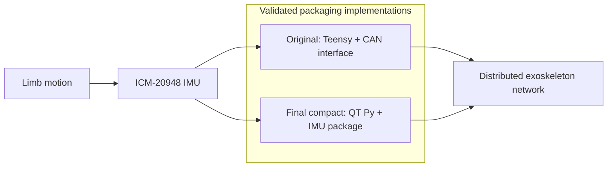

# Exoskeleton IMU and CAN Electronics Packaging

**SolidWorks · Mechanical design · Additive manufacturing · Mechatronics integration**

I designed and validated two lightweight, 3D-printable electronics-packaging implementations for an exoskeleton's distributed-control system: an original Teensy-based IMU/CAN package and a final compact QT Py + IMU package. Both address motion-capture interference, cable strain, service access, and exoskeleton mounting constraints.

## Project at a glance

| | |
| --- | --- |
| **My focus** | Mechanical packaging, CAD iteration, and design-for-printing |
| **Hardware** | Adafruit ICM-20948 IMU, Teensy microcontroller, QT Py SAMD21, and 5708 CAN Pal |
| **Key constraints** | Low mass, fast printing, IR light shielding, connector protection, and simple service access |
| **Mechanical interfaces** | V2 and V2.5 exoskeleton mounting patterns |
| **Status** | Both packaging implementations are complete and fully validated |
| **Deliverables** | Original five-generation CAD history, two compact-package versions, final SolidWorks assemblies, specifications, and completed validation records |

## My contribution

- Translated an advisor brief and electrical-system needs into mechanical packaging requirements.
- Developed the enclosure through multiple SolidWorks iterations rather than treating the first concept as a finished design.
- Designed around board support, connector access, cable routing, minimum wall thickness, and component clearances.
- Implemented the compact QT Py architecture to reduce package size while preserving the original engineering requirements.
- Addressed how indicator LEDs could be hidden from infrared motion-capture cameras while remaining accessible during debugging.
- Addressed strain relief so cable-yank loads transfer into the housing instead of board-mounted connectors.
- Defined and completed the physical validation needed before releasing the enclosure for use on the exoskeleton.

The work was collaborative: another team member focused on inter-device communications for distributed computing, while my focus was the physical packaging and hardware integration around that system.

## System context

## Engineering challenge

| Requirement | Why it matters | Validated response |
| --- | --- | --- |
| Block status lights | Infrared cameras may detect exposed indicators during motion capture | Opaque enclosure with deliberate debug-light access |
| Protect connectors | A yanked cable can damage a board-mounted connector | Housing-level cable capture and strain-relief features |
| Preserve service access | Hardware must be connected and inspected without removing the full system | Accessible cable exits and serviceable lid concepts |
| Support two exoskeleton versions | V2 and V2.5 use different IMU mounting interfaces | Common enclosure with mounting variants or interchangeable plates |
| Print quickly at low mass | The package is worn on a moving exoskeleton | Thin but controlled walls, compact geometry, and support-conscious design |
| Constrain electronics safely | Boards cannot move, short, or carry enclosure loads through components | Standoffs, positive board capture, and component clearance checks |

## Packaging implementations and design evolution

### Original Teensy-based package

| Iteration | Focus |
| --- | --- |
| **Design 1** | Baseline housing, hinged-lid exploration, and electronics packaging assembly |
| **Design 2** | Revised housing geometry and updated assembly packaging |
| **Design 3** | Further cover and lid refinement |
| **Design 4** | CAN Pal integration and a more complete communication-hardware stack |
| **Final** | Consolidated cover, snapping lid, CAN interface, IMU, and microcontroller assembly |
| **Lid tests** | Focused snap-fit and service-access experiments |

### Final compact QT Py package

| Iteration | Focus |
| --- | --- |
| **Version 1** | Initial compact QT Py, IMU, enclosure, and clamp assembly |
| **Final Version** | Refined, fully validated compact assembly containing 1 QT Py and 1 IMU |

The compact QT Py implementation contains one QT Py and one IMU. It was selected because it reduced the overall package size while retaining the original mechanical and motion-capture requirements.

## Completion and validation

**Status: both implementations are complete and fully validated.** The original Teensy-based package and the final compact QT Py package passed the validation required for their intended exoskeleton configurations. Validation covered:

- V2 and V2.5 mounting compatibility;
- board, connector, cable, and service-access fit;
- cable handling and strain relief;
- component and lid clearances;
- status-light shielding for motion capture and deliberate debug access;
- printability and repeated-use durability.

The repository preserves both validated packages together with the CAD iterations that led to their final designs.

## Explore the work

- Start with the [`Final Compact CAN Communications Packaging`](Final%20CAN%20Communications%20Packaging) for the implemented QT Py + IMU architecture and its initial and final CAD stages.
- Read the [`QT Py IMU Packaging Specifications`](Final%20CAN%20Communications%20Packaging/Notes%20and%20Specifications/QT%20Py%20IMU%20Packaging%20Specifications.md) for its compact architecture, inherited requirements, and completed validation.
- Review the [`Original CAN Communication Setup`](Original%20CAN%20Communication%20Setup) for the completed Teensy-based implementation and its full CAD design history.

Source-folder mapping

The original Teensy-package Drive folders used overlapping design numbers, so the repository folders are normalized chronologically while the SolidWorks filenames remain unchanged:

| Repository folder | Original Drive folder |
| --- | --- |
| Design 1 | Design 1 |
| Design 2 | Design 1, Part 2 |
| Design 3 | Design 2 |
| Design 4 | Design 3 |
| Final | FINAL DESIGN |
| Lid Tests | Lid Test 1 |

The initial archive is limited to material from the original IMU-packaging project folder and its child folders.

